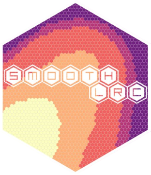

<!-- README.md is generated from README.Rmd. Please edit that file -->

# smoothLRC 

<!-- badges: start -->
<!-- badges: end -->

Smooth Low-Rank Clustering (smoothLRC) provides tools to analyze and
cluster spatial transcriptomics data.

## Installation

You can install the development version of smoothLRC from
[GitHub](https://github.com/) with:

``` r
# install.packages("devtools")
devtools::install_github("alexanderjwhite/smoothLRC")
```
